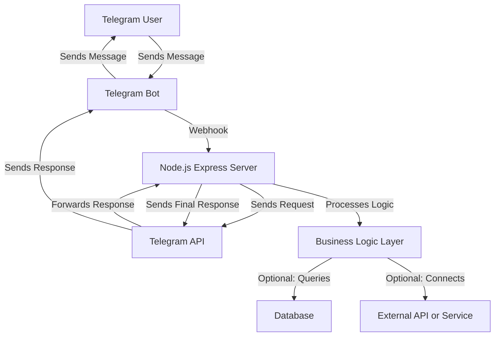
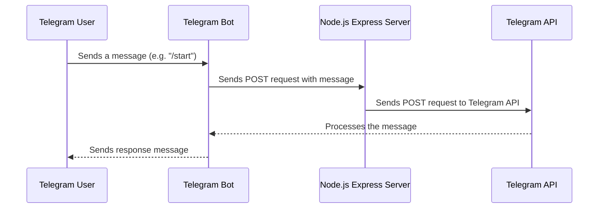

# Telegram Bot with nodeJs

Helps you to search from a database and read it remotely

## Deployment

This Telegram bot was deployed for free using webhooks and Express.js, making it efficient and cost-effective to run without the need for a dedicated polling server.

## Docker Example

Building the Docker Image
Build the Docker image using the following command:

```bash
docker build -t telegram-bot .
```

This command builds a Docker image named telegram-bot based on the instructions in your Dockerfile.

Running the Bot in a Docker Container
To start the bot, run it in a Docker container:

```bash
docker run -d -p 8000:8000 telegram-bot
```

This command starts the bot in a detached container, mapping port 8000 of the container to port 8000 on your host machine.

## Environment Configuration

Create a `.env` file for environment variables by using the provided `.env.example` template. Customize it with your own settings to configure the bot accordingly.

## Software Architecture




## How Telegram Bot Processes User Messages and Sends Automated Responses via Webhooks


## Start Developing Locally

### Step 1: Configure Environment Variables

- Copy the `.env.example` file to create a new `.env` file.
- Open the `.env` file and configure your environment variables as needed for your local development setup.

### Step 2: Set Up Port Forwarding

- If your server is running on `localhost:8000`, you need to expose it to the public for Telegram to communicate with it.
- You can use **Visual Studio Code**'s port forwarding feature or **ngrok** to forward the port to a public URL.

#### Using Visual Studio Code:

- Make sure you're running the server locally on port `8000`.
- Use VS Code’s built-in port forwarding to expose `localhost:8000` to a public address.
- Make sure visibility is set to public

### Step 3: Start the Development Server

- To start your bot in development mode, run the following command:

```bash
npm run dev
```

The server will now be running on localhost:8000, and if you’ve set up port forwarding, the Telegram bot can communicate with it.


